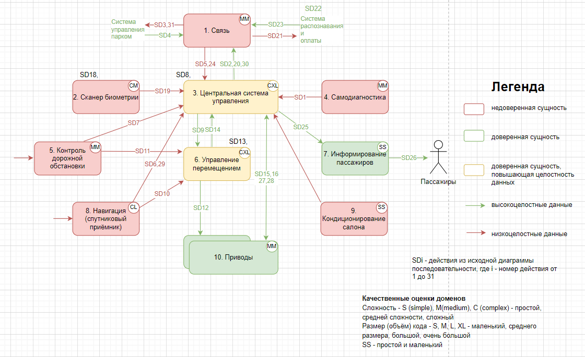
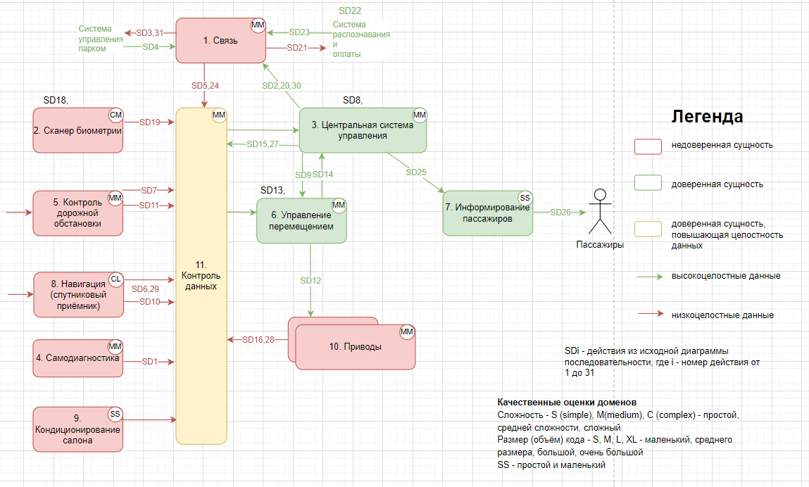
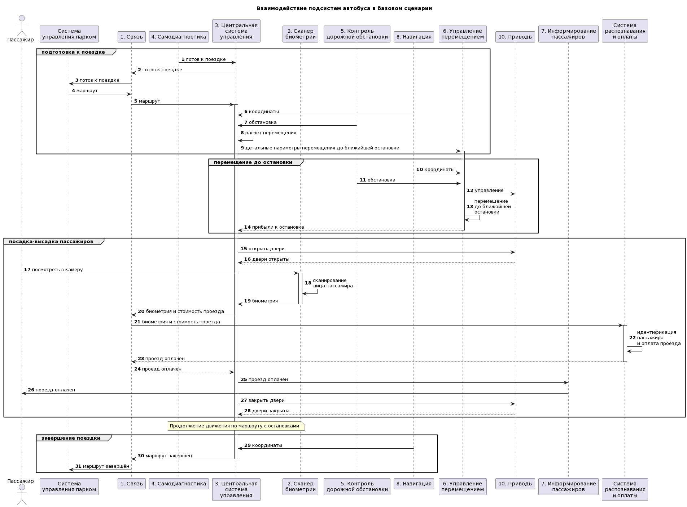
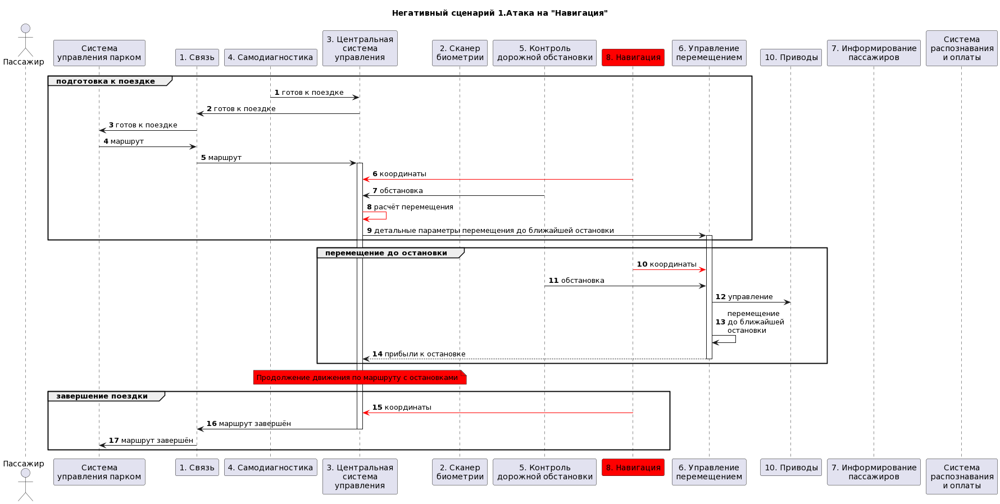
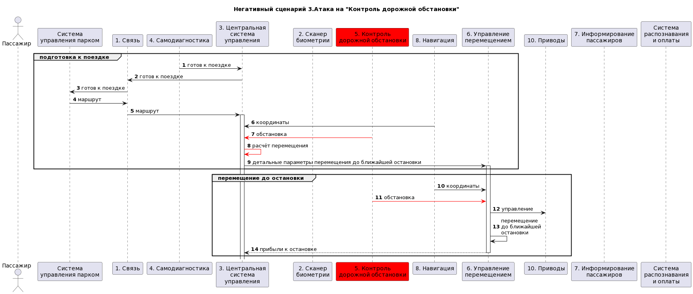

# Отчёт о выполнении задачи "Автономный автобус"

- [Отчёт о выполнении задачи "Автономный автобус"](#отчёт-о-выполнении-задачи-автономный-автобус)
  - [Постановка задачи](#постановка-задачи)
  - [Известные ограничения и вводные условия](#известные-ограничения-и-вводные)
    - [Цели и Предположения Безопасности (ЦПБ)](#цели-и-предположения-безопасности-цпб)
  - [Архитектура системы](#архитектура-системы)
    - [Компоненты](#компоненты)
    - [Алгоритм работы решения](#алгоритм-работы-решения)
    - [Описание Сценариев (последовательности выполнения операций), при которых ЦБ нарушаются](#описание-сценариев-последовательности-выполнения-операций-при-которых-цб-нарушаются)
    - [Указание "доверенных компонент" на архитектурной диаграмме.](#указание-доверенных-компонент-на-архитектурной-диаграмме)

## Постановка задачи
[_вернуться к оглавлению_](#отчёт-о-выполнении-задачи-автономный-автобус) 
Продукт - автономный автобус с бесконтактной оплатой проезда на основе биометрии. Автобус сканирует лицо пассажира на входе и проводит оплату после идентификации.

Предлагается
1. смоделировать два негативных сценария, в результате которых нарушаются цели безопасности
2. выбрать доверенные и недоверенные компоненты, для целей безопасности 1-3 раскрасить диаграмму в соответствии с нотацией политики архитектуры, обосновать свой выбор, сведя описание в таблицу
3. предложить свой вариант архитектуры. Можно изменить связи, количество и функциональное назначение существующих доменов безопасности, добавить новые. Цель - уменьшить объём доверенного кода. Сопроводить новую архитектуру описанием и анализом изменений.

## Известные ограничения и вводные условия
[_вернуться к оглавлению_](#отчёт-о-выполнении-задачи-автономный-автобус) 
1. от заказчика известны ценности продукта, негативные события в их отношении, величина ущерба
2. роли пользователей. Оператор системы - вводит информацию о маршрутах. Сотрудник депо - проверяет системы автобуса перед выходом на маршрут. Пассажиры - перемещаются в автобусе согласно маршруту.
3. контекст: системы в операционном окружении автономного автобуса, упрощения
4. базовый сценарий - перевозка пассажиров, отраженная на диаграммах последовательностей систем и подсистем. Есть BPMN одной поездки.

### Цели и Предположения Безопасности (ЦПБ)
[_вернуться к оглавлению_](#отчёт-о-выполнении-задачи-автономный-автобус) 
Цели безопасности:
1. Выполняются только аутентичные задания на перевозки
2. Для перемещения используется только авторизованный маршрут
3. Перемещение осуществляется только в авторизованных границах параметров перемещения, с учётом временных скоростных ограничений
4. Только авторизованные пользователи имеют доступ к конфиденциальным данных пассажиров

Предположения безопасности:
- система планирования перевозок благонадёжна
- дорожные знаки аутентичны и установлены авторизованным образом
- система распознавания биометрии и оплаты проезда благонадёжна
- на всём протяжении авторизованных маршрутов исключено появление людей
- на всём протяжении авторизованных маршрутов исключено внезапное появление препятствий, для избежания столкновения с которым необходимо превысить максимально допустимое ускорение при торможении

## Архитектура системы
[_вернуться к оглавлению_](#отчёт-о-выполнении-задачи-автономный-автобус) 

**Исходная политика архитектуры**

[ссылка на код "Исходная политика архитектуры", лист HLAv0.00](./hla.drawio)

**Переработанная политика архитектуры**

[ссылка на код "Переработанная политика архитектуры", лист HLAv0.01](./hla.drawio)

### Компоненты
[_вернуться к оглавлению_](#отчёт-о-выполнении-задачи-автономный-автобус) 

**Исходные компоненты**
| Название | Назначение |
|----|----|
| *1. Связь (conn)* | отвечает за взаимодействие с системой распределения задач на перевозки и с системой оплаты проезда
| *2. Сканер биометрии (scan)* | сканирует лицо пассажира в 3D
| *3. Центральная система управления (central)* | осуществляет общее управление процессом перевозки пассажиров автобусом
| *4. Самодиагностика (diag)* | осуществляет сбор и анализ телеметрии всех подсистем для оценки работоспособности системы
| *5. Контроль дорожной обстановки (road)* | отвечает за анализ дорожных знаков, светофоров, перемещения других объектов (машин, людей, зверей), дорожной разметки и стационарных препятствий
| *6. Управление перемещением (transfer)* | отвечает за перемещение автобуса по заданному маршруту с учётом дорожной обстановки
| *7. Информирование пассажиров (infotainment)* | оповещает о состоянии оплаты для входящих пассажиров, маршруте, текущей и следующей остановки, температуре в салоне
| *8. Навигация (nav)* | получает и обрабатывает навигационную информацию о положении автобуса
| *9. Кондиционирование салона (conditioning)* | обеспечивает требуемую температуру в салоне
| *10. Приводы (servos)* | реализуют управление всей мехатроникой автобуса

**Новые компоненты**
| Название | Назначение |
|----|----|
| *11. Контроль данных (monitor_data)* | программные средства, позволяющие проверить аутентичность полученных данных

### Алгоритм работы решения
[_вернуться к оглавлению_](#отчёт-о-выполнении-задачи-автономный-автобус) 

Исходная подробная диаграмма последовательности

[ссылка на код "Исходная подробная диаграмма последовательности"](./a-bus_sd_detailed_base.puml)

### Описание Сценариев (последовательности выполнения операций), при которых ЦБ нарушаются
[_вернуться к оглавлению_](#отчёт-о-выполнении-задачи-автономный-автобус) 

|№  | Название | Скомпрометированный компонент | Нарушенная цель безопасности | Вариант переработки |
|----|----|----|----|----|
|1 | Атака на "Навигация" | Навигация | 1,2,3 | добавить доверенный домен Контроль данных
|2 | Утечка персональных данных | Сканер биометрии | 4 | добавить доверенный домен Контроль данных
|3 | Подмена данных в дорожной обстановке | Контроль дорожной обстановки | 1,2,3,4 | добавить доверенный домен Контроль данных
|4 | Атака на "Связь" | Связь | 1,2,3 | добавить доверенный домен Контроль данных

Не проводилось моделирование угроз для компонентов Центральная система управления, Управление перемещением, Самодиагностика, Кондиционирование, Приводы.

**Отдельная диаграмма для негативного сценария 1.Атака на "Навигация":**
 Например, выдает некорректные координаты, автономный автобус уезжает не к той ближайшей остановке.
 Исходя из "Исходная подробная диаграмма последовательности" можно спрогнозировать место и время атаки в 3-х точках (SD6,10,29):
- в блоке "подготовка к поездке" после передачи маршрута от Связи к ЦСУ
- после отправки ЦСУ детальных параметров перемещения до ближайшей остановки в Управление перемещением
- перед завершением поездки 

Представлен фрагмент из "Исходная подробная диаграмма последовательности" с указанием скомпрометированного домена и действием

[ссылка на код Негативный сценарий 1.Атака на "Навигация""](./sd_negative1.puml)
 [_вернуться к оглавлению_](#отчёт-о-выполнении-задачи-автономный-автобус)

**Отдельная диаграмма для негативного сценария 3.Атака на "Контроль дорожной обстановки":**
 Например, через подмена данных в дорожной обстановке.
 Исходя из "Исходная подробная диаграмма последовательности" можно спрогнозировать место и время атаки в 2-х точках (SD7,11):
- в блоке "подготовка к поездке" перед внутренним расчётом перемещения в ЦСУ, который уже будет неверными
- в блоке "перемещение до остановки" перед отдачей команды управления Приводам от УП

Представлен фрагмент из "Исходная подробная диаграмма последовательности" с указанием скомпрометированного домена и действием

[ссылка на код Негативный сценарий 3.Атака на "Контроль дорожной обстановки"](./sd_negative3.puml)
 [_вернуться к оглавлению_](#отчёт-о-выполнении-задачи-автономный-автобус)

### Указание "доверенных компонент" на архитектурной диаграмме.
[_вернуться к оглавлению_](#отчёт-о-выполнении-задачи-автономный-автобус) 
Сначала была составлена политика архитектуры, в которой все домены были отмечены как недоверенные. Затем произведено моделирование угроз, составлены негативные сценарии. На основе негативных сценариев составлена "Исходная политика архитектуры". В негативных сценариях предложен вариант переработки. На основе вариантов переработки составлена "Переработанная политика архитектуры". В "Переработанная политика архитектуры" снижен уровень доверия к компонентам  и повышен к  путём добавления новых доменов, а также изменился уровень сложности и размера кода:

__Исходная политика архитектуры__

_Недоверенные компоненты_
|ЦБ № | Компонент | Уровень доверия | Обоснование |
|----|----|----|----|
| 1,2,3 | Навигация | недоверенный | составлен негативный сценарий (см.рисунок)
| 4 | Сканер безопасности | недоверенный | составлен негативный сценарий (см.рисунок)
| 1,2,3,4 | Контроль дорожной обстановки | недоверенный | составлен негативный сценарий
| 1,2,3 | Связь | недоверенный | составлен негативный сценарий на уроке
|  | Самодиагностика | недоверенный | не моделировались угрозы
|  | Кондиционирование салона | недоверенный | не моделировались угрозы

_Доверенные компоненты, повышающие целостность данных_
|ЦБ № | Компонент | Уровень доверия | Обоснование |
|----|----|----|----|
|  | Центральная система управления | доверенный, повышающий целостность данных | отдает высокоцелостные данные доверенному домену "Информирование пассажиров". Получает низкоцелостные данные от скомпрометированных компонент.
|  | Управление перемещением | доверенный, повышающий целостность данных | отдает высокоцелостные данные доверенному домену "Приводы". Получает низкоцелостные данные от скомпрометированных компонент.

_Доверенные компоненты_
|ЦБ № | Компонент | Уровень доверия | Обоснование |
|----|----|----|----|
|  | Информирование пассажиров | доверенный | получает высокоцелостные данные от компонента (жёлтый домен - ЦСУ), для которого не моделировались угрозы, но который в свою очередь получают низкоцелостные данные
|  | Приводы | доверенный | получают высокоцелостные данные от компонент (жёлтые домены - ЦСУ, УП), для которых не моделировались угрозы, но которые в свою очередь получают низкоцелостные данные

__Переработанная политика архитектуры__

_Недоверенные компоненты_
|ЦБ № | Компонент | Уровень доверия | Обоснование |
|----|----|----|----|
| 1,2,3 | Навигация | недоверенный | передаёт данные в новый жёлтый домен, повышающий целостность данных, введенный из-за наличия негативного сценария
| 4 | Сканер безопасности | недоверенный | передаёт данные в новый жёлтый домен, повышающий целостность данных, введенный из-за наличия негативного сценария
| 1,2,3,4 | Контроль дорожной обстановки | недоверенный | передаёт данные в новый жёлтый домен, повышающий целостность данных, введенный из-за наличия негативного сценария
| 1,2,3 | Связь | недоверенный | составлен негативный сценарий на уроке
|  | Самодиагностика | недоверенный | передаёт данные в новый жёлтый домен, повышающий целостность данных
|  | Кондиционирование салона | недоверенный | передаёт данные в новый жёлтый домен, повышающий целостность данных
|  | Приводы | недоверенный | передаёт данные в новый жёлтый домен, повышающий целостность данных, следовательно, снижен уровень доверия

_Доверенные компоненты, повышающие целостность данных_
|ЦБ № | Компонент | Уровень доверия | Обоснование |
|----|----|----|----|
|  | Контроль данных | доверенный, повышающий целостность данных | новый домен, выступает в качестве монитора безопасности  

_Доверенные компоненты_
|ЦБ № | Компонент | Уровень доверия | Обоснование |
|----|----|----|----|
|  | Центральная система управления | доверенный | - взаимодействует со скомпрометированными компонентами через новый жёлтый домен, повышающий целостность данных, - уменьшена сложнось и размер кодовой базы
|  | Управление перемещением | доверенный | взаимодействует со скомпрометированными компонентами через новый жёлтый домен, повышающий целостность данных, - уменьшена сложнось и размер кодовой базы
|  | Информирование пассажиров | доверенный | - получает высокоцелостные данные от доверенного компонента ЦСУ, - должен быть зеленым, чтобы передавать достоверную информацию пассажирам, как ценному активу